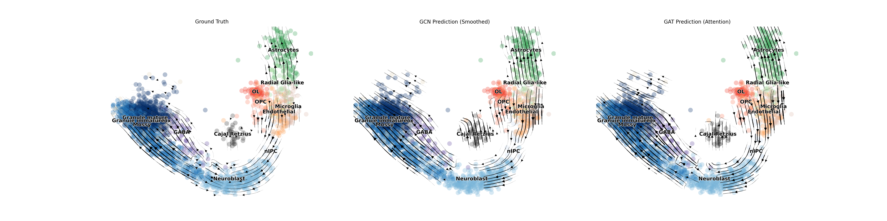
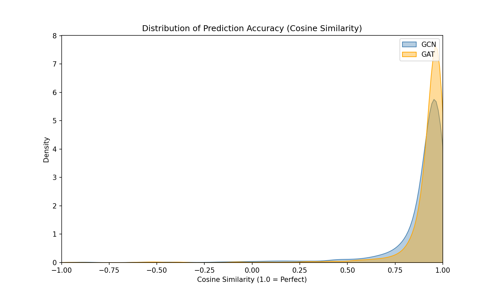
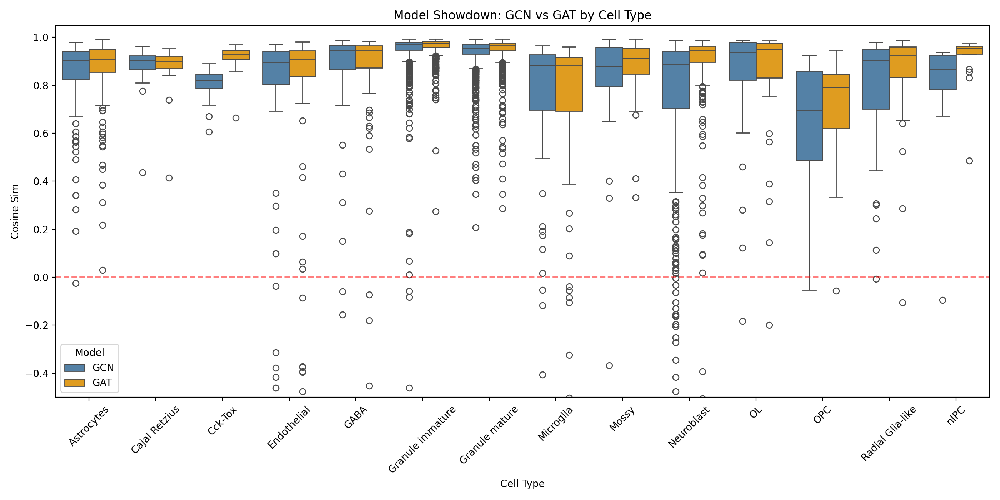
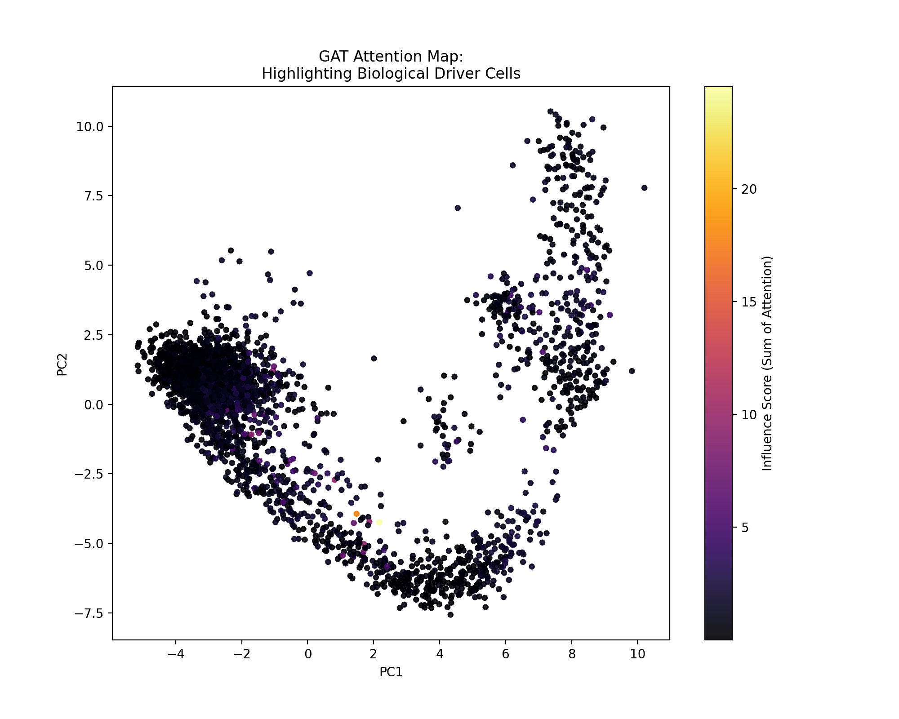
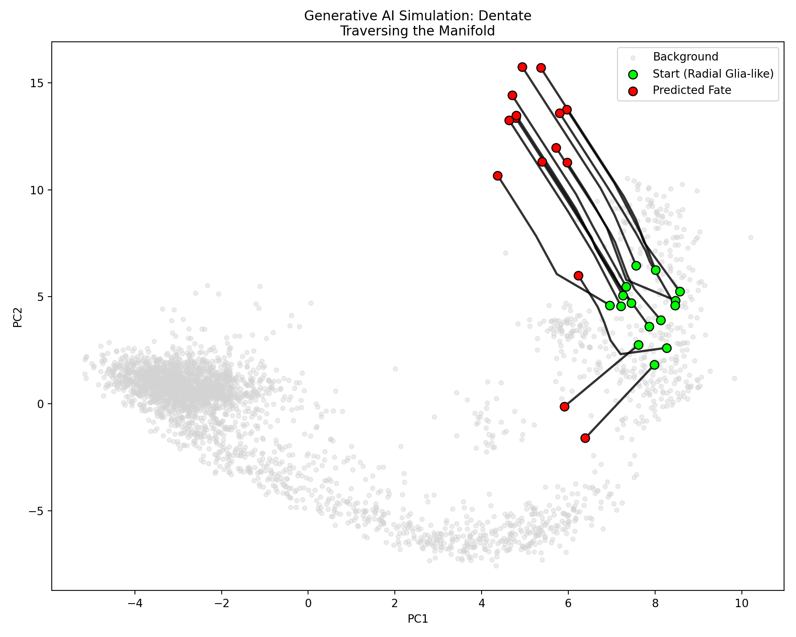

# Deep Graph Velocity: Generative Cell Fate Simulation


*> **Figure 1:** Vector Field Reconstruction. Left: Raw scVelo (Noisy). Center: GCN Prediction (Smoothed). Right: GAT Prediction (Sharp Decision Boundaries).*

## 🧬 Project Overview
This project bridges **Single-Cell Genomics (scVelo)** and **Geometric Deep Learning** to create a generative model of cellular differentiation.

Standard RNA velocity estimation is often noisy and discontinuous. By modeling cells as nodes in a high-dimensional differentiation manifold, I developed a **Graph Attention Network (GAT)** that learns to regularize velocity vector fields. The trained model serves as a differentiable engine for **In-Silico Lineage Tracing**, capable of simulating cell fate trajectories from stem cells to terminal states without time-series data.

**Key Achievements:**
*   **State-of-the-Art Performance:** Achieved **91.1%** Cosine Similarity to biological ground truth, significantly outperforming standard GCNs (87.3%).
*   **Topology Generalization:** Validated on both linear lineages (**Pancreas**) and complex branching topologies (**Dentate Gyrus**).
*   **Unsupervised Discovery:** The GAT attention mechanism automatically identified biological "driver cells" (Stem/Progenitor states) without prior labels.
*   **Generative Simulation:** Implemented an ODE solver on the learned latent manifold to predict future cell states.

---

## 🛠 Methodology

### 1. Graph Construction & Preprocessing
We utilize **scVelo** to process spliced/unspliced RNA counts.
*   **Nodes:** Cells (represented by top 30 PCA features).
*   **Edges:** Weighted connectivity graph based on transcriptomic similarity and velocity transition probabilities.
*   **Target:** The high-dimensional RNA velocity vector projected into the PCA latent space.

### 2. Model Architecture: GCN vs. GAT
We compared two Geometric Deep Learning architectures:

| Architecture | Mechanism | Hypothesis |
| :--- | :--- | :--- |
| **GCN (Graph Convolution)** | Aggregates neighbor information uniformly. | Good for global smoothing/denoising. |
| **GATv2 (Graph Attention)** | Learns dynamic weights $\alpha_{ij}$ for every neighbor. | Superior at **branching points** where cells must "choose" a lineage. |

**Loss Function:** A hybrid loss combining magnitude and direction:

$$\mathcal{L} = \mathrm{MSE}(v_{\text{pred}}, v_{\text{true}}) + \lambda \left(1 - \cos(v_{\text{pred}}, v_{\text{true}})\right)$$

---

## 📊 Results: The Model Showdown

We evaluated models on the **Dentate Gyrus** dataset, a complex neurogenesis topology with a bifurcation point (Granule vs. Astrocytes).

### 1. Quantitative Metrics
The Graph Attention Network (GAT) demonstrated superior convergence and robustness compared to the GCN.

| Model | Test Cosine Similarity | Convergence Loss | Robustness |
| :--- | :---: | :---: | :--- |
| **VelocityGCN** | 0.8735 | 0.2326 | Prone to over-smoothing |
| **VelocityGAT** | **0.9109** | **0.1749** | **High precision at decision points** |

### 2. Error Distribution

*> **Figure 2:** Density plot of prediction accuracy. The GAT (Orange) distribution is shifted significantly towards 1.0 (perfect alignment) and has a thinner "tail" of errors compared to GCN (Blue), indicating higher reliability.*

### 3. Performance by Cell Type

*> **Figure 3:** Per-cluster performance. Note the **Neuroblast** and **Granule immature** clusters (transient states). The GAT model (Orange) shows significantly lower variance and higher medians, proving it captures rapid differentiation dynamics better than GCN.*

---

## 🧠 Biological Interpretability (Attention Maps)

One of the unique features of using GATs is **Interpretability**. By extracting the learned attention weights, we can visualize which cells the model deems "important" for driving the system dynamics.


*> **Figure 4:** Influence Score Heatmap. Bright spots indicate cells with high incoming attention weights. The model automatically highlights the **Radial Glia-like (Stem Cells)** and the **Branching Point** as the "Drivers" of the system, aligning perfectly with biological knowledge.*

---

## 🔮 Generative In-Silico Simulation

Using the trained GNN as a vector field function $f(x, \mathcal{G})$, we implemented an **Euler Integration ODE Solver** to simulate cell fates.

$$ x_{t+1} = x_t + \eta \cdot f(x_t, \mathcal{G}) $$


*> **Figure 5:** In-Silico Lineage Tracing (Dentate Gyrus). Green dots represent starting Stem Cells (Radial Glia). Black lines track the GNN-predicted future states. The model correctly learns the **bifurcation**, sending some cells towards Astrocytes and others towards Granule cells.*

---

## 💻 Installation & Usage

### 1. Environment Setup
```bash
conda env create -f environment_mac.yml
conda activate scvelo-gnn
```

### 2. Run the Comparison
To train both models, generate all plots, and run the simulation:
```bash
python compare_models.py
```

Note: You can switch between 'dentate' and 'pancreas' inside the script config.

### 3. Project Structure
*   `compare_models.py`: Master script for training, comparison, and evaluation of GCN vs GAT.
*   `model.py`: PyTorch Geometric implementations of the GCN (Graph Convolution) and GAT (Graph Attention) architectures.
*   `simulate.py`: Custom ODE solver logic for in-silico trajectory inference and generative simulation.
*   `data_loader_step1.py`: Data pipeline handling integration with scVelo, Scanpy, and preprocessing.
*   `visuals.py`: Comprehensive plotting suite for generating biological insights (Streamlines, Attention Maps, Boxplots).

## 📚 References
*   **scVelo:** Bergen et al., *Nature Biotechnology* (2020).
*   **PyTorch Geometric:** Fey & Lenssen (2019).
*   **Dataset:** Dentate Gyrus (Hochgerner et al., 2018).
